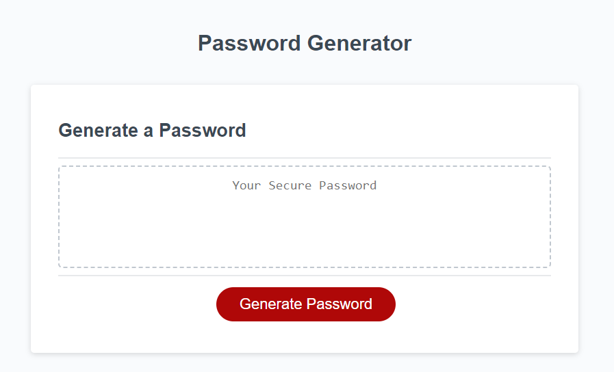
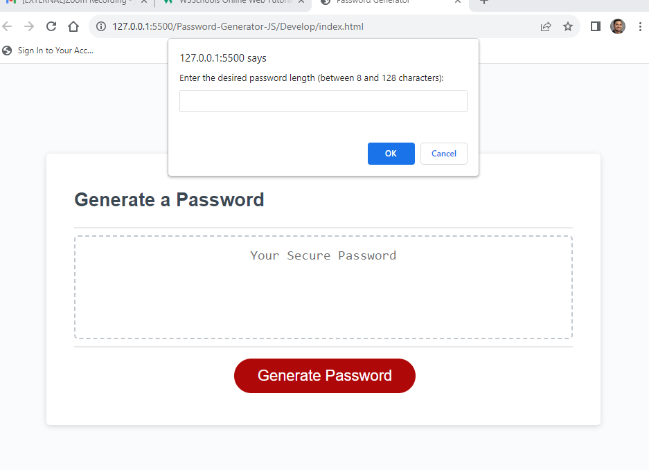
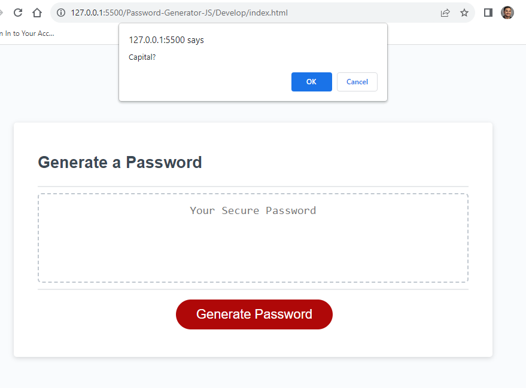
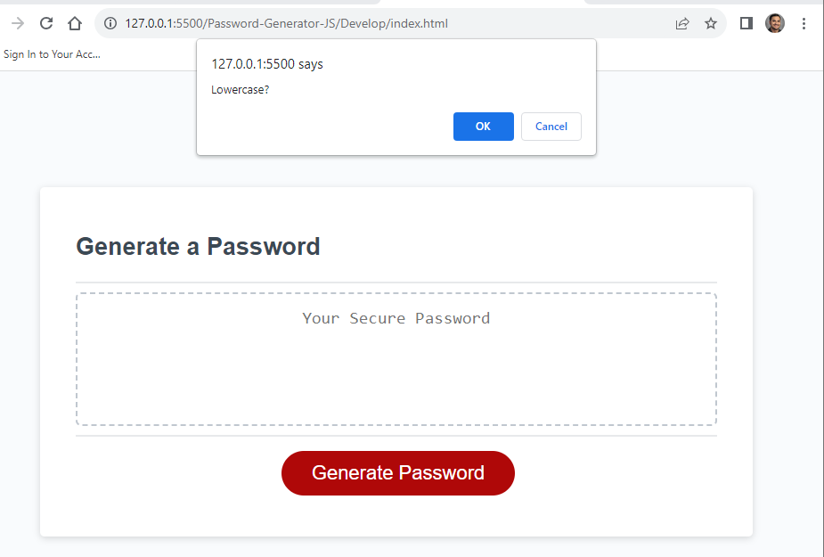
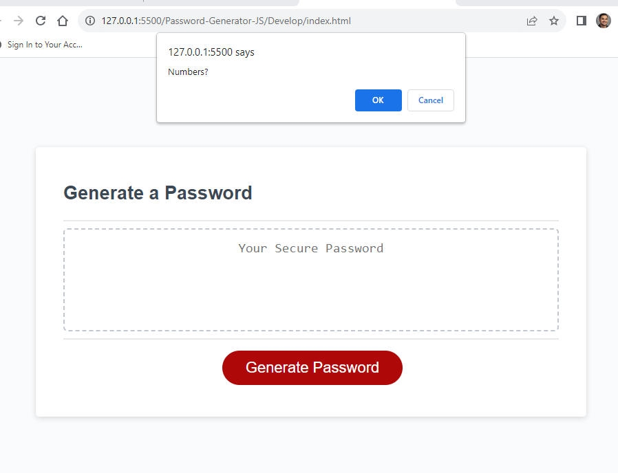
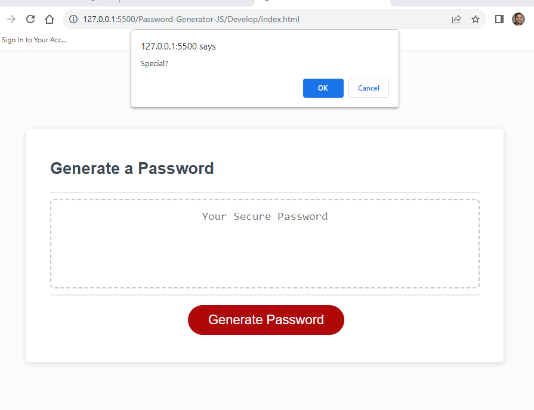
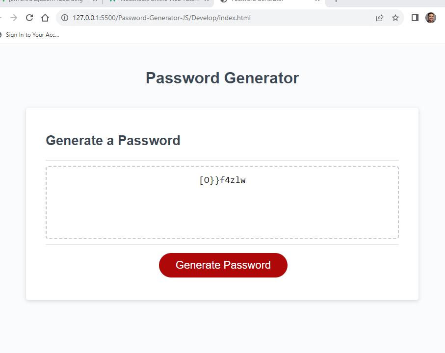

# Password Generator JavaScript Project

## Project Description

This is a simple Password Generator project written in JavaScript. The purpose of this project is to create strong and secure passwords for various online accounts or applications. Users can customize the password length and choose which types of characters (uppercase letters, lowercase letters, numbers, and special characters) to include in their generated password.

## Table of Contents

- Installation
- Usage
- Credits
- Features

## Installation

Clone this repository to your local machine or download and extract the ZIP file.

Open the project folder in your preferred code editor or simply double-click the index.html file to open it in a web browser.

## Usage

- Open the index.html file in your web browser.

- You will see a user interface with an option to generate your password:

- Click on "Generate Password" to begin the process.

- Password Length: Set the desired length of your password (between 8 and 128 characters).

- Character Types: Check the character types you want to include in your password (Uppercase Letters, Lowercase Letters, Numbers, Special Characters).

- Your generated password will appear in the "Generated a Password" text box.

- You can generate additional passwords by clicking the "Generate Password" icon.

- Visual step by step guide: 

## Credits

Andres Jimenez - EDX Bootcamp Tutoring Services 
Zoom Recording: https://zoom.us/rec/share/gwnZUggF4iBCXn93x2Zrjs4P5ZK_2Pge_jVurqF4RssdHc45Ol6AUpRkZWo9jrFq.8adOEDRIFYfq2__a

W3 Schools: https://www.w3schools.com/

## Features

- Generates strong and secure passwords.

- Customizable password length.

- Allows users to choose the character types to include in the password.

- Provides a user-friendly interface for generating passwords.

- Copy password to clipboard with a single click.